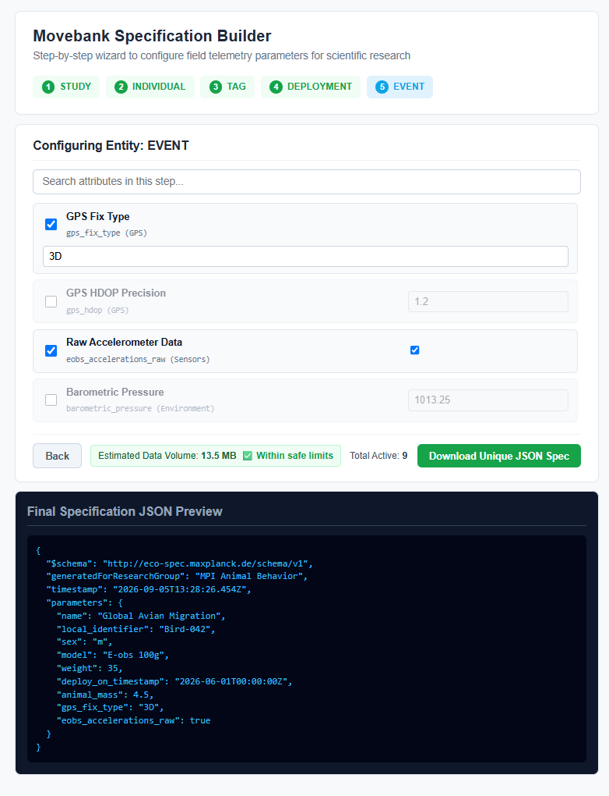

# Movebank Eco-Spec Configuration Tool

A professional-grade, responsive Angular 22 web application designed for scientific research groups to configure, validate, and export research-compliant JSON schemas for animal telemetry data.

## Key Features

- Guided Multi-Step Wizard: Traverses the core Movebank entity hierarchy sequentially: study, individual, tag, deployment, and event.

- Modern Reactive State: Built natively on Angular Signals (signal, computed, inject()) for predictable, high-performance state management without boilerplate overhead.

- Real-Time Data Volume Estimation: Dynamically computes expected storage footprints based on active parameter counts and triggers safe-limit visual warnings.

- Granular Field Validation: Enforces per-attribute numeric range rules (min/max) and blocks navigation or export until step-level criteria are satisfied.

- Adaptive Responsive Design: Compact grid layout with intelligent field scaling, automatically expanding text inputs (like study names and descriptions) into comfortable full-width blocks.

- Instant JSON Export: Compiles active parameters into a structured specification schema for direct browser-side blob downloading.

## Architecture & Tech Stack

- Framework: Angular 22 (Standalone Components, Signals API)

- Styling: Custom modular SCSS with fluid media-query breakpoints and CSS custom properties.

- Separation of Concerns: Thin component architecture that delegates business rules, validation logic, and state mutations entirely to the core BuilderService.

## 🚀 Live Demo

🔗 **[View Live Application on Cloudflare Pages](https://eco-spec.pages.dev/)**

## 📄 License

- This project is open-source and available under the [MIT License](./LICENSE).
